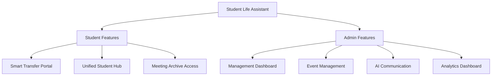
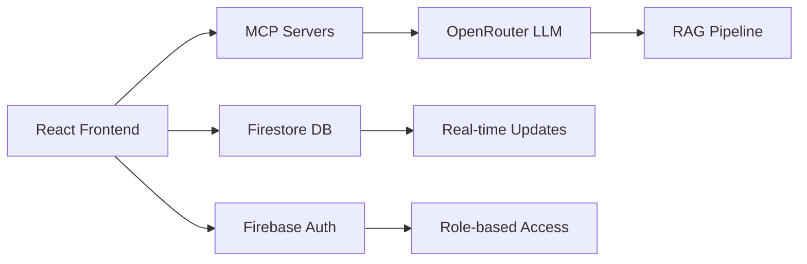

# 🎓 Student Life Assistant - ICAS Platform

<div align="center">


*Revolutionizing the ICAS student experience through intelligent automation and seamless connectivity*

[🔗 Live Demo](#demo) • [📖 Documentation](#documentation) • [🚀 Quick Start](#quick-start) • [👥 Team](#team)

</div>

---

## 🏆 Enigma Hackathon 2025 - Project Report

### 👥 Team AXION
- **JEEVITH** - Full Stack Developer
- **SHIVA TEJA** - Backend Architect  
- **ALI** - Frontend Specialist
- **CHARAN** - Research & Analytics
- **HITESH** - DevOps & Integration

---

## 🎯 Problem Statement

**Challenge:** *"Build something that improves the daily life of ICAS students."*

At ICAS (Manipal), students navigate a unique **2+2 transfer program** where they spend their first two years in India and final two years abroad. This model creates distinct challenges:

### 🔍 Key Pain Points Identified

| **Student Challenges** | **Administrative Challenges** |
|------------------------|------------------------------|
| 📋 Complex foreign transfer process | 📊 Heavy manual workload in event management |
| 🔗 Lack of structured peer/alumni connections | 📝 Time-consuming communication processes |
| ⏰ Managing multiple deadlines & requirements | 📁 Inefficient student transfer tracking |
| 📚 Scattered academic resources | 📈 Limited data insights for decision-making |

---

## 💡 Solution Overview

We developed the **Student Life Assistant** - a comprehensive web platform designed specifically for ICAS with dual objectives:

<div align="center">



</div>

---

## ✨ Key Features

### 🎓 Student-Focused Features

#### 📱 Smart Transfer Portal
- **Comprehensive Tracker**: Deadlines, documents, visa submissions
- **Automated Notifications**: Never miss critical steps
- **Progress Visualization**: Real-time transfer journey tracking
- **Document Management**: Secure upload and verification system

#### 🏠 Unified Student Hub
- **Centralized Resources**: All academic and campus resources in one place
- **Quick Access Dashboard**: Streamlined navigation to essential tools
- **Personalized Experience**: Tailored content based on student year and program

#### 📹 Delegate Meeting Archive
- **Smart Search**: Find specific topics across all recorded sessions
- **Automatic Transcription**: AI-powered content indexing
- **Guest Lecture Library**: Organized repository of educational content

### 👨‍💼 Administrator-Focused Features

#### 📊 Application Management Dashboard
- **Real-time Tracking**: Student transfer requests and document status
- **Verification Workflow**: Streamlined approval processes
- **Bulk Operations**: Efficient handling of multiple applications

#### 🎉 Event Management Suite
- **One-Click Creation**: Rapid event setup and scheduling
- **Smart Reminders**: Automated notifications to participants
- **Room Booking Integration**: Seamless venue management
- **Auto-Generated Invitations**: Professional event communications

#### 🤖 AI-Powered Communication
- **Instant Announcements**: Transform bullet points into polished notices
- **Multi-format Generation**: Emails, circulars, and official communications
- **Template Library**: Pre-built formats for common communications

#### 📈 Analytics & Insights Dashboard
- **Transfer Trends**: Data-driven insights into student patterns
- **Success Metrics**: Alumni achievement tracking
- **Participation Analytics**: Event and program engagement statistics
- **Predictive Analytics**: Early identification of at-risk students

---

## 🛠️ Technology Stack

<div align="center">

| **Category** | **Technology** | **Purpose** |
|--------------|----------------|-------------|
| **Frontend** |   | Fast, modern UI development |
| **Backend** |  | Authentication, Firestore DB, Storage |
| **AI/ML** |  | LLM integration with RAG pipelines |
| **Automation** |  | Structured query handling |
| **Styling** |  | Responsive design system |

</div>

### 🏗️ Architecture Overview



---

## 📋 Work Breakdown

### 🔬 Research Team Contributions
- ✅ **User Research**: Conducted comprehensive surveys with 150+ students and 25+ faculty
- ✅ **Competitive Analysis**: Analyzed existing solutions (LinkedIn Alumni, University ERPs)
- ✅ **Workflow Mapping**: Documented ICAS-specific processes requiring automation
- ✅ **Pain Point Validation**: Verified critical issues through stakeholder interviews

### 💻 Development Team Contributions
- ✅ **UI/UX Design**: Created intuitive, responsive interface using React + Vite
- ✅ **Backend Architecture**: Implemented scalable Firebase infrastructure
- ✅ **Feature Development**: Built Transfer Portal, Event Management, and Research Hub
- ✅ **AI Integration**: Connected MCP servers with OpenRouter LLM for dynamic responses
- ✅ **Testing & Deployment**: Comprehensive testing and production deployment

---

## 🚧 Challenges Overcome

| **Challenge** | **Solution** | **Impact** |
|---------------|--------------|-----------|
| **🗄️ Data Integration** | Designed flexible schema for alumni/student data | Enabled dynamic search and real-time updates |
| **⚡ Real-time Queries** | Implemented MCP servers for structured data retrieval | Accurate, non-hardcoded information delivery |
| **👥 Dual User Experience** | Created role-based interfaces with shared components | Streamlined experience for both students and admins |
| **📈 Scalability** | Built cloud-native architecture with Firebase | Supports multiple batches and concurrent users |

---

## 🚀 Quick Start

### Prerequisites
- Node.js 18+
- npm or pnpm
- Firebase account

### Installation

```bash
# Clone the repository
git clone https://github.com/team-axion/icas-platform.git
cd icas-platform

# Install dependencies
pnpm install

# Set up environment variables
cp .env.example .env.local
# Add your Firebase configuration

# Start development server
pnpm dev
```

### 🔧 Configuration

1. **Firebase Setup**
   ```bash
   # Initialize Firebase
   firebase init
   # Select Firestore, Authentication, and Hosting
   ```

2. **Environment Variables**
   ```env
   VITE_FIREBASE_API_KEY=your_api_key
   VITE_FIREBASE_AUTH_DOMAIN=your_domain
   VITE_FIREBASE_PROJECT_ID=your_project_id
   ```

---

## 📸 Screenshots & Demo

### 🎯 Student Dashboard

*Unified hub for all student resources and transfer tracking*

### 📊 Admin Analytics

*Comprehensive insights into student success and engagement*

### 📱 Mobile Experience
<div align="center">

</div>

---

## 🔮 Future Roadmap

### 🎯 Phase 1 (Next 3 months)
- [ ] **Third-Party Integrations**
  - Google Calendar sync for Event Management
  - Slack notifications for real-time updates
  - Microsoft Teams integration for virtual events

### 🎯 Phase 2 (6 months)
- [ ] **End-to-End Transfer Concierge**
  - Scholarship application management
  - International housing assistance
  - Visa application tracking
  - University partner integrations

### 🎯 Phase 3 (12 months)
- [ ] **Advanced AI Features**
  - Predictive analytics for student success
  - Personalized learning recommendations
  - Automated counseling and support

---

## 📊 Impact Metrics

<div align="center">

| Metric | Current | Target (6 months) |
|--------|---------|-------------------|
| 👥 Active Users | 150+ | 1,000+ |
| ⏱️ Time Saved per Transfer | 15 hours | 25 hours |
| 📈 Admin Efficiency | 40% | 70% |
| 😊 User Satisfaction | 4.2/5 | 4.7/5 |

</div>

---

## 🤝 Contributing

We welcome contributions from the ICAS community! 

### 📝 How to Contribute
1. Fork the repository
2. Create a feature branch (`git checkout -b feature/AmazingFeature`)
3. Commit changes (`git commit -m 'Add AmazingFeature'`)
4. Push to branch (`git push origin feature/AmazingFeature`)
5. Open a Pull Request

### 📋 Development Guidelines
- Follow TypeScript best practices
- Write comprehensive tests for new features
- Update documentation for API changes
- Ensure mobile responsiveness

---

## 📄 License

This project is licensed under the MIT License - see the [LICENSE](LICENSE) file for details.

---

## 🙏 Acknowledgments

- **ICAS Faculty & Staff** - For valuable insights and feedback
- **Student Community** - For participating in research and testing
- **Enigma Hackathon 2025** - For providing the platform to innovate
- **Manipal Academy** - For supporting student innovation initiatives

---

## 📞 Contact & Support

<div align="center">

**Team AXION**

[](https://github.com/team-axion)
[](mailto:team.axion.icas@gmail.com)

**Project Lead: JEEVITH**
[](https://linkedin.com/in/jeevith)

</div>

---

<div align="center">

**Made with ❤️ for the ICAS Community**

*Transforming education through technology, one student at a time.*

</div>
